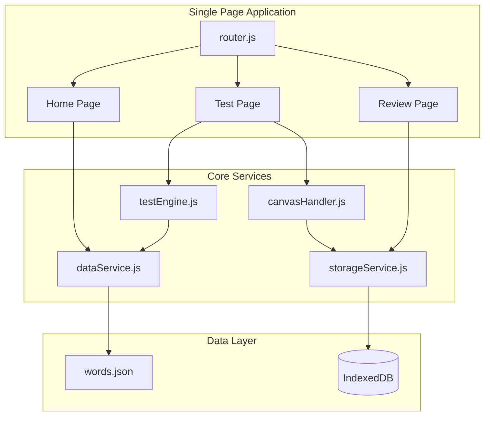
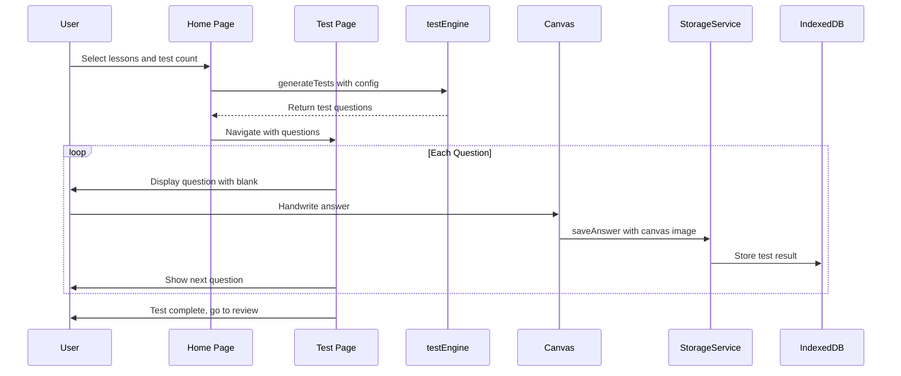
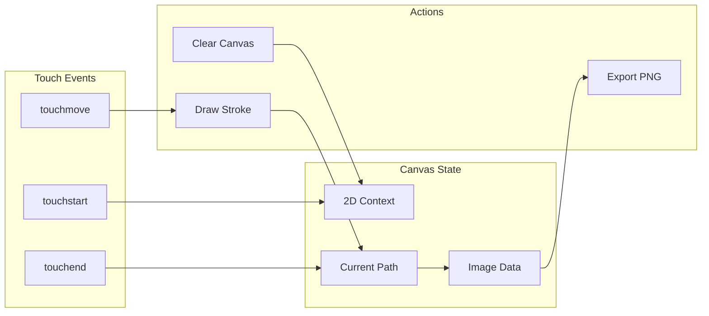

# 國字注音練習 - Architecture Plan

## Overview
A Vue.js-based Chinese character and Zhuyin (Bopomofo) practice app for children, optimized for iPad handwriting input.

---

## File Structure

```
國字注音練習/
├── index.html              # Main entry point (CDN Vue)
├── words.json              # Character data (existing)
├── css/
│   └── style.css           # All styles, iPad-optimized
├── js/
│   ├── app.js              # Vue app initialization + router
│   ├── services/
│   │   ├── dataService.js      # Load/parse words.json
│   │   ├── testEngine.js       # Test generation logic
│   │   └── storageService.js   # IndexedDB operations
│   └── components/
│       ├── HomePage.js         # Home page component
│       ├── TestPage.js         # Test page component
│       ├── ReviewPage.js       # Parent review component
│       ├── LessonSelector.js   # Lesson tree selector
│       └── HandwritingCanvas.js # Canvas component
└── plans/
    └── architecture.md     # This file
```

---

## System Architecture



---

## Data Flow



---

## Component Details

### 1. Home Page - Selection Interface

**State:**
- `selectedLessons: string[]` - Array of selected lesson IDs
- `testCount: number` - Number of questions
- `testType: 'char' | 'zhuyin' | 'mixed'` - Test mode

**UI Elements:**
- Collapsible accordion by Grade → Semester → Book → Lesson
- Checkbox for each lesson (multi-select)
- Number input for test count
- Radio buttons for test type
- Start Test button

### 2. Test Page - Question Interface

**State:**
- `questions: Question[]` - Generated questions
- `currentIndex: number` - Current question index
- `sessionId: string` - Unique test session ID

**Question Display:**
The tested item is shown with styled underline - self-explanatory, no labels needed.

| Type | Display Example | User Action |
|------|-----------------|-------------|
| Write Character | <u style="color:#e74c3c">ㄧㄡˋ</u>手 | Handwrite 右 |
| Write Zhuyin | <u style="color:#e74c3c">右</u>手 | Handwrite ㄧㄡˋ |

**Styling for tested portion:**
- Distinct color (red/orange) with underline
- Larger font size for emphasis
- Box or highlight effect optional

**UI Elements:**
- Question display with styled underline
- Large canvas area for handwriting (min 300x300px)
- Clear button to reset canvas
- Next button to proceed
- Progress indicator (3/10)

### 3. Review Page - Parent View

**State:**
- `sessions: TestSession[]` - All saved sessions
- `selectedSession: string | null` - Currently viewing

**UI Elements:**
- List of test sessions by date
- Grid view of answers (question + handwritten image)
- Delete session option

---

## IndexedDB Schema

**Database:** `ZhuyinPracticeDB`

**Object Store: `testSessions`**
```typescript
interface TestSession {
  id: string;              // UUID
  timestamp: number;       // Unix timestamp
  lessonIds: string[];     // Selected lessons
  testType: string;        // char, zhuyin, mixed
  totalQuestions: number;
}
```

**Object Store: `answers`**
```typescript
interface Answer {
  id: string;              // UUID
  sessionId: string;       // FK to testSessions
  questionIndex: number;   // Order in test
  questionType: string;    // char or zhuyin
  targetChar: string;      // The character being tested
  targetZhuyin: string;    // The zhuyin of the character
  contextWord: string;     // The full word for context
  canvasData: Blob;        // PNG image of handwriting
  timestamp: number;
}
```

---

## Canvas Handwriting Implementation



**Key Features:**
- Touch-optimized (Apple Pencil support)
- Stroke width: 4-6px
- Black ink on white/light background
- Grid lines optional (like 田字格)
- Export as PNG Blob for storage

---

## UI Wireframes

### Home Page
```
┌─────────────────────────────────────┐
│  國字注音練習                        │
├─────────────────────────────────────┤
│  📚 選擇課文                         │
│  ┌─────────────────────────────────┐│
│  │ ▼ 一年級 上學期                  ││
│  │   ▼ 甲本                        ││
│  │     ☑ 第一課 拍拍手             ││
│  │     ☐ 第三課 秋千               ││
│  │     ☐ 第五課 比一比             ││
│  │   ▶ 乙本                        ││
│  └─────────────────────────────────┘│
│                                     │
│  📝 題數: [10] 題                    │
│                                     │
│  ✍️ 測驗類型:                        │
│  ○ 看注音寫國字                     │
│  ○ 看國字寫注音                     │
│  ● 混合題型                         │
│                                     │
│  ┌─────────────────────────────────┐│
│  │         開始測驗                 ││
│  └─────────────────────────────────┘│
│                                     │
│  [查看歷史紀錄]                      │
└─────────────────────────────────────┘
```

### Test Page
```
┌─────────────────────────────────────┐
│  第 3 題 / 共 10 題                  │
├─────────────────────────────────────┤
│                                     │
│           ┌───────────┐             │
│           │  右  手   │             │
│           │  ▔▔       │             │
│           │ (underlined in red)     │
│           └───────────┘             │
│                                     │
│  ┌─────────────────────────────────┐│
│  │                                 ││
│  │                                 ││
│  │      [Handwriting Canvas]       ││
│  │         300 x 300               ││
│  │                                 ││
│  │                                 ││
│  └─────────────────────────────────┘│
│                                     │
│  [清除]              [下一題 →]      │
│                                     │
└─────────────────────────────────────┘
```

### Review Page
```
┌─────────────────────────────────────┐
│  歷史紀錄                     [首頁] │
├─────────────────────────────────────┤
│  ┌─────────────────────────────────┐│
│  │ 📅 2026/01/26 下午 3:15         ││
│  │    10題 - 第一課、第三課         ││
│  │    [查看] [刪除]                ││
│  ├─────────────────────────────────┤│
│  │ 📅 2026/01/25 上午 10:30        ││
│  │    5題 - 第二課                  ││
│  │    [查看] [刪除]                ││
│  └─────────────────────────────────┘│
└─────────────────────────────────────┘

┌─────────────────────────────────────┐
│  2026/01/26 測驗結果          [返回] │
├─────────────────────────────────────┤
│  ┌────────┐  ┌────────┐  ┌────────┐ │
│  │Q1: 右手 │  │Q2: 秋千 │  │Q3: 高山 │ │
│  │寫注音   │  │寫國字   │  │寫注音   │ │
│  │[手寫圖] │  │[手寫圖] │  │[手寫圖] │ │
│  └────────┘  └────────┘  └────────┘ │
│  ┌────────┐  ┌────────┐  ┌────────┐ │
│  │Q4: ... │  │Q5: ... │  │Q6: ... │ │
│  │        │  │        │  │        │ │
│  │[手寫圖] │  │[手寫圖] │  │[手寫圖] │ │
│  └────────┘  └────────┘  └────────┘ │
└─────────────────────────────────────┘
```

---

## Technical Decisions

| Aspect | Decision | Rationale |
|--------|----------|-----------|
| Framework | Vue.js 3 (CDN) | Reactive UI, component-based, no build step |
| Routing | Vue Router (hash mode) | SPA navigation, works offline |
| Styling | Pure CSS | iPad-optimized, minimal dependencies |
| Storage | IndexedDB | Large Blob storage for canvas images |
| Canvas | HTML5 Canvas | Native touch support, PNG export |

---

## iPad Optimizations

1. **Touch Events**: Use `touchstart/move/end` with `preventDefault()` to avoid scroll interference
2. **Viewport**: `<meta name="viewport" content="width=device-width, initial-scale=1, maximum-scale=1, user-scalable=no">`
3. **Canvas Size**: Minimum 300x300px for comfortable writing
4. **Font Size**: Minimum 18px for readability
5. **Button Size**: Minimum 44x44px touch targets
6. **Apple Pencil**: Support pressure sensitivity if available

---

## Implementation Order

1. **Phase 1**: Basic structure
   - HTML skeleton
   - CSS base styles
   - Router setup

2. **Phase 2**: Data layer
   - dataService.js - Load words.json
   - storageService.js - IndexedDB setup

3. **Phase 3**: Home page
   - Lesson selection UI
   - Test configuration

4. **Phase 4**: Test engine
   - Question generation
   - Random selection

5. **Phase 5**: Canvas
   - Touch drawing
   - PNG export
   - Clear functionality

6. **Phase 6**: Test page
   - Question display
   - Canvas integration
   - Answer saving

7. **Phase 7**: Review page
   - Session list
   - Answer grid view
   - Delete functionality

---

## Future Enhancements (Out of Scope)

- Server sync for multi-device
- Character stroke order animation
- Auto-grading with ML
- Audio pronunciation
- Statistics and progress tracking
